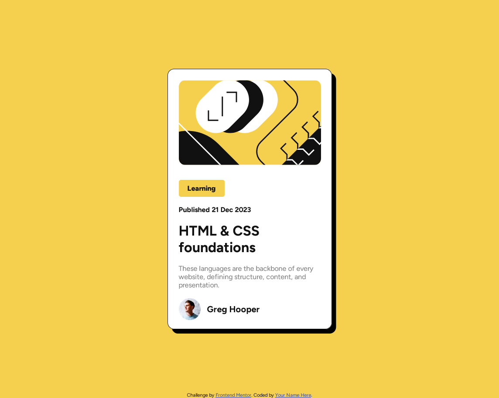

# Frontend Mentor - Blog preview card solution

This is a solution to the [Blog preview card challenge on Frontend Mentor](https://www.frontendmentor.io/challenges/blog-preview-card-ckPaj01IcS). Frontend Mentor challenges help you improve your coding skills by building realistic projects. 

## Table of contents

- [Overview](#overview)
  - [The challenge](#the-challenge)
  - [Screenshot](#screenshot)
  - [Links](#links)
- [My process](#my-process)
  - [Built with](#built-with)
  - [Continued development](#continued-development)
  - [Useful resources](#useful-resources)
- [Author](#author)

**Note: Delete this note and update the table of contents based on what sections you keep.**

## Overview

### The challenge

Users should be able to:

- See hover and focus states for all interactive elements on the page

### Screenshot

### Links

- Solution URL: [solution URL](https://github.com/MeowB/blog-preview-card-main)
- Live Site URL: [live site URL](https://meowb.github.io/blog-preview-card-main/)

## My process

### Built with

- Semantic HTML5 markup
- Sass
- Flexbox

### Continued development

I want to continue focusing on the front-end part of development, using more flexbox and even if i'm getting more and more comfortable with css, i still get stuck sometimes and have to dig for information.

### Useful resources

- [Chatgpt](https://chat.openai.com/) - This helped me as a quick question helper, i used it to ask layout questions and to talk about my project when i get stuck.
- [Flexbox cheet sheet](https://flexbox.malven.co/) - This helped me remember how to use flexbox for the name part, i used it to center vertically the content and have the image on the same line as the h2

## Author

- Website - [Scott Borlon](https://github.com/MeowB)
- Frontend Mentor - [@MeowB](https://www.frontendmentor.io/profile/MeowB)
